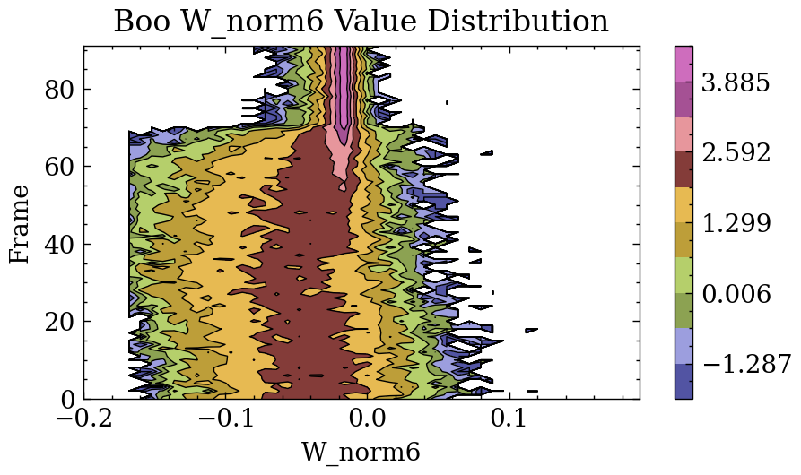

# GlassViewer
Pyscal_Glassviewer is a FORK of Pyscal, which is modified and improved for Metal Glass data post-processing tasks by Zihao Bai, Jilin University. Calculation of some new order parameters are implemented. Parrallel analysis for MD trajectory is implemented. 
## Support for New Order Parameters 
|No.|Function|Implement|Comment|
|----|-----|----|----|
|1|Pair distribution function|Improved|Parallel support, long-range calculation support|
|2|Structure factor|Glassviewer|Integration method and FFT method|
|3|Coordination number|Improved|Improvement for cell expansion style|
|4|Chemical short-range order_Cowley|Pyscal|
|5|Chemical short-range order_Cargill-Spaepen|Glassviewer||	
|6|Bond angle distribution|Glassviewer|Support for Wn order parameter, bug repair for BOO components|
|7|Bond orientational order|Improved||
|8|Common neighbor analysis|Pyscal||
|9|Voronoi tessellation|Pyscal||
|10|File IO|Improved|Support for XDATCAR|

### How to use?
A jupyternotebook file (./glassviewer/glassviewer.ipynb) with detailed comments clearly demonstrates calculation for all the above order parameters.

## Support for Parallel Analysis for Molecular Dynamics Trajectories
A jupyternotebook file (./glassviewer/MDanalysis.ipynb) with detailed comments clearly demonstrates parallel analysis for MD trajectories.
## Support for Direct Visualization of Order parameters

Using Glassviewer, you can conviniently visualize BOO distributions as follows.

BOO vs Time distribution

Joint BOO distribution

A jupyternotebook file (./glassviewer/Visualize.ipynb) with detailed comments clearly demonstrates parallel analysis for MD trajectories.

