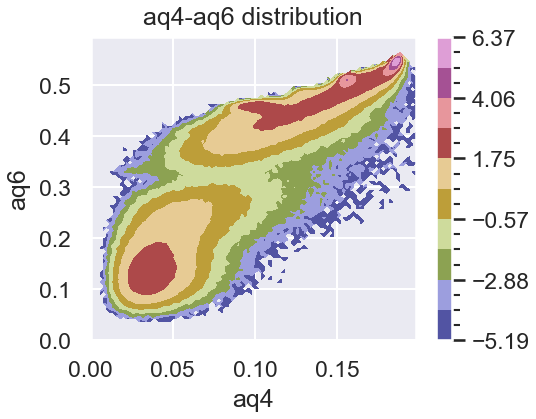

# GlassViewer
GlassViewer is a FORK of Pyscal, which provides automatic parallel order parameter calculation for multiple MD trajectories. Meanwhile, it is specially modified and improved for Nucleation Problems and Metal Glass Systems. 

GlassViewer is designed by Zihao Bai, Jilin University.  
## Overview

Using GlassViewer you can get average order parameters of a whole MD trajectory very efficiently. This helps with getting reliable and clear analysis figures from MD trajectories of small systems. Meanwhile, it can calculate the time evolution of some important parameters like Cluster Size and Bond Order Orientation. Apart from that, you can use GlassViewer to compare multiple MD trajectories easily and directly.

For instance, you can generate beautiful analysis work as follows in "one command".

Could you imagine that the last smooth figures are generated from only 108 atoms? This result is calculated from 600x4 MD frames within only 1 minute using GlassViewer. There are more pictures provided in our documents. Please see the DOCUMENT section below.

GlassViewer also provides special support for Statistics of Nucleation Problems like First Pass Time Statistics. Calculation tools for some important order parameters are also provided, such as Structure Factors, Bond angle distribution, Cargill-Spaepen Chemical short-range order, and BOO-Wn quantities.

## Features
1. Support for **automatic parallel analysis** for multiple MD trajectories.
2. Support for **automatic visualization** for all order parameters.
3. Support for **more important order parameters**. 
4. Support for **First Pass Time** and **ClusterSize vs Time** calculation.
5. Support for **BOO vs Time** and **Joint BOO Distribution** calculation.
## Installation
It is very easy to install this package, please execute the following commands
    git clone https://github.com/bgbaizh/GlassViewer.git
    cd GlassViewer
    pip install . 
## Documents
Three explicit jupyter-notebook files in the "glassviewer-benchmark" directory demonstrate the usage and features of GlassViewer vividly.
|No.|Name|Comment|
|----|-----|----|
|1|POSCAR.ipynb|Present calculation for all order parameters for a single POSCAR|
|1|Nucleation.ipynb|Present use of GlassViewer in Nucleation Problem|
|1|LiMgAlloy.ipynb|Present use of GlassViewer in Multi-component Systems|

## Support for New Order Parameters 
|No.|Function|Implement|Features in Glassviewer|
|----|-----|----|----|
|1|Pair distribution function|Improved in Glassviewer|Parallel support, long-range calculation support, partial PDF support|
|2|Structure factor|New in Glassviewer|Integration method and FFT method|
|3|Coordination number|Pyscal|Modified cell expansion style|
|4|Chemical short-range order_Cowley|Pyscal|
|5|Chemical short-range order_Cargill-Spaepen|New in Glassviewer||	
|6|Bond angle distribution|New in Glassviewer|Support for Wn order parameter|
|7|Bond orientational order|Improved in Glassviewer||
|8|Common neighbor analysis|Pyscal||
|9|Voronoi tessellation|Pyscal||
|10|File IO|Improved in Glassviewer|Support for XDATCAR|

## Citing

A publication for Glassviewer is being prepared. If you are going to use GlassViewer in your work, it would be great if you let me know.